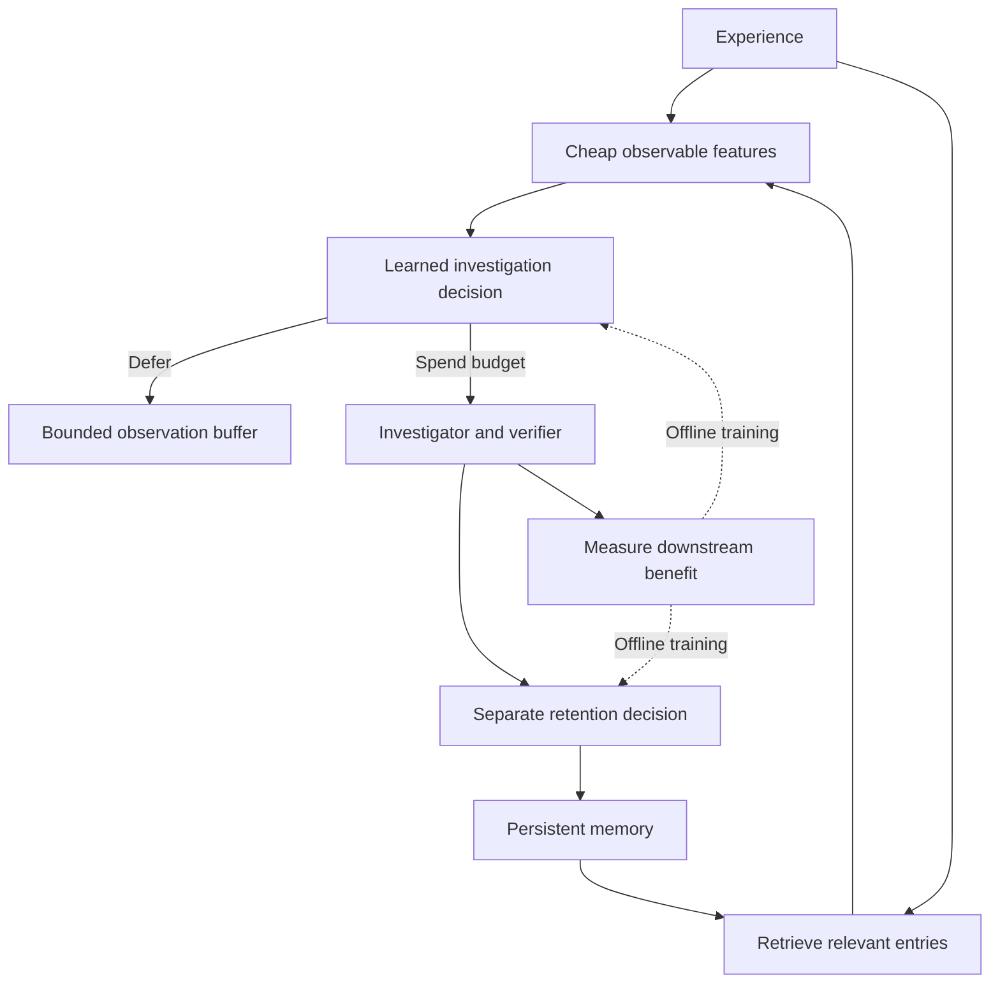

# Novelty Extraction

**A reference implementation of selective learning: decide what to investigate, check the evidence, and retain useful knowledge updates.**

This project asks:

> What mechanisms let an AI agent cheaply detect which parts of an experience deserve deeper processing—and learn to make that decision better?

The repository includes a working, dependency-free Python prototype and a proposal for integrating the mechanism with DeepSeek-V4.1-Flash. It is an experimental starting point for contributors, not a claim to have solved general novelty extraction or reproduced a brain mechanism.

## Run in under a minute

Requires Python 3.10 or newer. From this repository:

```bash
python3 -m novelty_extraction demo --output runs/demo
python3 -m unittest discover -s tests -v
```

The demo runs entirely offline. It trains two small linear value heads, evaluates five policies on separate synthetic worlds, and writes `controller.json` and `report.json`. No API key, GPU, model download, or third-party runtime dependency is needed.

To install the command-line entry point in your environment:

```bash
python3 -m pip install .
novelty-extraction --help
```

## The mechanism



Novelty depends on what the agent already knows and what it needs to do. Repetition can add evidence. A familiar-looking exception can be valuable. Random noise can be surprising without being useful.

The proposed controller estimates the improvement caused by an action and compares that improvement with its cost:

```text
value(action) = expected downstream improvement − resource price × action cost
```

Investigation and retention are separate decisions. A model's persuasive explanation is not, by itself, verification.

## What works today

| Component | Status |
|---|---|
| Streaming JSONL experiences with explicit claim and evidence fields | Implemented |
| SQLite memory, hypotheses, verified revisions, deferred buffer, decision audit | Implemented |
| Budget accounting for scanning, retrieval, control, investigation, writes | Implemented in abstract units |
| Learned investigation and retention heads | Implemented as small ridge regressions |
| All, random, lexical-novelty, and claim-deduplication baselines | Implemented |
| Paired memory ablations and deterministic synthetic evaluation | Implemented |
| Optional DeepSeek API critic | Implemented; mock-tested, not live-validated |
| Neural head attached to DeepSeek encoder states | Research design only |
| Automatic semantic claim extraction, general factual verification | Not implemented |
| Continual weight updates, learned replay, complementary-clue reasoning | Research directions |

The prototype uses explicit claim keys and simple observable features. It does **not** access DeepSeek hidden states or claim to implement a pretrained-model novelty detector.

## Reproducible example result

The checked-in [reference report](benchmarks/reference-report.json) was generated with `python3 -m novelty_extraction demo`. Training uses seeds 0–7; evaluation uses seeds 100–109. Each policy receives 180 abstract cost units per world. All policies start with 4 correct answers out of 16.

| Policy | Final accuracy, mean ± sample SD | Mean investigations |
|---|---:|---:|
| Investigate all | 0.531 ± 0.099 | 28.0 |
| Random | 0.500 ± 0.088 | 18.0 |
| Lexical novelty | 0.338 ± 0.060 | 16.9 |
| Claim deduplication | 0.588 ± 0.060 | 26.3 |
| Learned | 0.806 ± 0.086 | 14.7 |

These results demonstrate the control loop on **synthetic fact acquisition with a perfect fixture verifier**. They do not establish improvements on DeepSeek, natural-language discovery, wall-clock efficiency, or general reasoning. The lexical-novelty baseline is not LM surprisal. Sample SD describes variation across worlds, not a confidence interval. See the [evaluation protocol](docs/evaluation.md).

## Process your own experience stream

```bash
python3 -m novelty_extraction run \
  --events examples/events.jsonl \
  --goals examples/goals.json \
  --evidence examples/evidence.json \
  --memory runs/example.sqlite
```

The example rejects an incorrect retry rule, stores an evidence-supported correction, and defers an unsupported generalization. The supplied evidence file is a **fictional trusted measurement registry**, not a real test of a service.

An experience looks like this:

```json
{
  "event_id": "observation-001",
  "text": "This endpoint requires an idempotency key after a timeout.",
  "source": "execution-test",
  "claim": {
    "key": "service:S/retry/timeout",
    "value": "requires-idempotency-key"
  },
  "evidence_refs": ["test:retry-without-key"]
}
```

Include applicability conditions in the key. The reference implementation does not infer them from prose. Event IDs must identify immutable experiences. See [extending the system](docs/extending.md) for interfaces and memory semantics.

## DeepSeek integration

The [architecture proposal](docs/deepseek-v4.1.md) identifies an encoder readout, two learned value heads, persistent experience memory, and a budget-aware scheduler. It distinguishes these additions from the published architecture and explains why MoE routing and Engram lookup do not already implement the proposed loop.

An optional API critic is available:

```bash
# Set DEEPSEEK_API_KEY in your environment first; never commit it.
python3 -m novelty_extraction run \
  --events examples/events.jsonl \
  --goals examples/goals.json \
  --memory runs/deepseek.sqlite \
  --investigator deepseek \
  --model deepseek-flash
```

This makes paid network calls and sends each selected experience and its retrieved memories to the configured endpoint. It uses the Chat Completions interface; endpoint availability and model names can change. The API adapter produces **hypotheses only**. Its critiques are recorded in the local audit; unresolved events remain in the bounded pending buffer. Add a domain verifier to promote claims. Provider token usage is reported separately; the abstract budget is not a dollar cap.

## Build on it

Good first contributions include:

- A benchmark requiring combinations of individually unhelpful observations.
- A verifier based on executable tests or independently observed outcomes.
- A semantic retrieval adapter evaluated against the existing lookup baseline.
- A trained encoder head with measured inference overhead.
- A benchmark for source dependence, changing facts, or harmful memory updates.

Read [CONTRIBUTING.md](CONTRIBUTING.md), the [research design](docs/design.md), and the [limitations](docs/limitations.md). Related foundations are collected in [references](docs/references.md).

## License and attribution

MIT licensed. This is an independent project, unaffiliated with DeepSeek. No DeepSeek weights or implementation files are redistributed. External models and datasets retain their own licenses. See [CITATION.cff](CITATION.cff) to cite this software.
